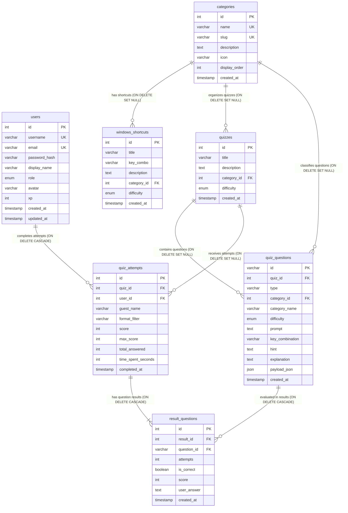

# inCTRL Database Wireframe & Schema Layout

This document provides a comprehensive wireframe and Entity-Relationship (ER) model of the **inCTRL** database (`inctrl_db`) as defined in [`docker/init.sql`](file:///C:/Users/oscar/inCTRL/docker/init.sql).

---

## 1. Visual Entity-Relationship (ER) Diagram

---

## 2. Table Wireframe Cards

Below is the layout of each table representing keys, data types, nullability, defaults, and relations.

### 2.1. `users`
> **Purpose**: User accounts, authentication credentials, roles, and gamification points (XP).

| Column | Type | Constraints / Attributes | Description |
| :--- | :--- | :--- | :--- |
| `id` | `INT` | **PK**, `AUTO_INCREMENT`, `NOT NULL` | Unique user identifier |
| `username` | `VARCHAR(50)` | **UNIQUE**, `NOT NULL` | Handle / login username |
| `email` | `VARCHAR(100)` | **UNIQUE**, `NOT NULL` | User email address |
| `password_hash`| `VARCHAR(255)` | `NOT NULL` | Bcrypt hashed password |
| `display_name` | `VARCHAR(100)` | `NOT NULL` | Public profile name |
| `role` | `ENUM('user', 'admin')` | `DEFAULT 'user'` | Access control role |
| `avatar` | `VARCHAR(255)` | `DEFAULT 'default-avatar.png'` | Path or file name of avatar image |
| `xp` | `INT` | `DEFAULT 0` | Experience points accrued from quizzes |
| `created_at` | `TIMESTAMP` | `DEFAULT CURRENT_TIMESTAMP` | Account registration timestamp |
| `updated_at` | `TIMESTAMP` | `DEFAULT CURRENT_TIMESTAMP ON UPDATE CURRENT_TIMESTAMP` | Last profile update timestamp |

---

### 2.2. `categories`
> **Purpose**: Taxonomy grouping shortcut commands and curated quiz sets.

| Column | Type | Constraints / Attributes | Description |
| :--- | :--- | :--- | :--- |
| `id` | `INT` | **PK**, `AUTO_INCREMENT`, `NOT NULL` | Unique category identifier |
| `name` | `VARCHAR(100)` | **UNIQUE**, `NOT NULL` | Category name (e.g., *Essential Windows Navigation*) |
| `slug` | `VARCHAR(100)` | **UNIQUE**, `NOT NULL` | URL-friendly slug (e.g., `essential-navigation`) |
| `description` | `TEXT` | `NULL` | Category summary |
| `icon` | `VARCHAR(50)` | `DEFAULT 'keyboard'` | Frontend icon identifier |
| `display_order`| `INT` | `DEFAULT 0` | Sort order index for UI display |
| `created_at` | `TIMESTAMP` | `DEFAULT CURRENT_TIMESTAMP` | Record creation timestamp |

---

### 2.3. `windows_shortcuts`
> **Purpose**: Reference library for Windows hotkeys, search catalogue, and quick-reference cards.

| Column | Type | Constraints / Attributes | Description |
| :--- | :--- | :--- | :--- |
| `id` | `INT` | **PK**, `AUTO_INCREMENT`, `NOT NULL` | Unique shortcut identifier |
| `title` | `VARCHAR(150)` | `NOT NULL` | Action title (e.g., *Direct Task Manager*) |
| `key_combo` | `VARCHAR(100)` | `NOT NULL` | Keyboard shortcut keys (e.g., `Ctrl + Shift + Esc`) |
| `description` | `TEXT` | `NOT NULL` | Detailed function and use cases |
| `category_id` | `INT` | **FK** &rarr; `categories(id)`, `NULL`, `ON DELETE SET NULL` | Parent category reference |
| `difficulty` | `ENUM('Beginner', 'Intermediate', 'Advanced')` | `DEFAULT 'Beginner'` | Skill tier |
| `created_at` | `TIMESTAMP` | `DEFAULT CURRENT_TIMESTAMP` | Record creation timestamp |

---

### 2.4. `quizzes`
> **Purpose**: Curated quiz packages and practice sets grouping multiple questions.

| Column | Type | Constraints / Attributes | Description |
| :--- | :--- | :--- | :--- |
| `id` | `INT` | **PK**, `AUTO_INCREMENT`, `NOT NULL` | Unique quiz identifier |
| `title` | `VARCHAR(150)` | `NOT NULL` | Quiz title (e.g., *Essential Navigation Mastery*) |
| `description` | `TEXT` | `NULL` | Purpose / scope of the quiz |
| `category_id` | `INT` | **FK** &rarr; `categories(id)`, `NULL`, `ON DELETE SET NULL` | Thematic category reference |
| `difficulty` | `ENUM('Beginner', 'Intermediate', 'Advanced')` | `DEFAULT 'Beginner'` | Difficulty level |
| `created_at` | `TIMESTAMP` | `DEFAULT CURRENT_TIMESTAMP` | Quiz creation timestamp |

---

### 2.5. `quiz_questions`
> **Purpose**: Master bank of questions supporting all 9 interactive quiz formats.

| Column | Type | Constraints / Attributes | Description |
| :--- | :--- | :--- | :--- |
| `id` | `VARCHAR(50)` | **PK**, `NOT NULL` | Alphanumeric identifier (e.g., `sc-1`, `kb-2`, `fb-1`) |
| `quiz_id` | `INT` | **FK** &rarr; `quizzes(id)`, `NULL`, `ON DELETE SET NULL` | Parent curated quiz |
| `type` | `VARCHAR(50)` | `NOT NULL` | Question format type (see formats below) |
| `category_id` | `INT` | **FK** &rarr; `categories(id)`, `NULL`, `ON DELETE SET NULL` | Category reference |
| `category_name`| `VARCHAR(100)` | `NOT NULL` | Denormalized category display name |
| `difficulty` | `ENUM('Beginner', 'Intermediate', 'Advanced')` | `DEFAULT 'Beginner'` | Question difficulty tier |
| `prompt` | `TEXT` | `NOT NULL` | Question prompt / text |
| `key_combination` | `VARCHAR(100)` | `NULL` | Shortcut combo string associated with question |
| `hint` | `TEXT` | `NULL` | Optional helper hint |
| `explanation` | `TEXT` | `NULL` | Educational answer review and context |
| `payload_json` | `JSON` | `NOT NULL` | Format-specific config (options, pairs, orders, banks) |
| `created_at` | `TIMESTAMP` | `DEFAULT CURRENT_TIMESTAMP` | Question creation timestamp |

> **Supported `type` values**:
> `single_choice`, `multiple_choice`, `fill_blank`, `key_builder`, `matching`, `ordering`, `true_false`, `live_press`, `odd_one_out`.

---

### 2.6. `quiz_attempts`
> **Purpose**: Overall quiz sessions, aggregate scores, and leaderboard tracking.

| Column | Type | Constraints / Attributes | Description |
| :--- | :--- | :--- | :--- |
| `id` | `INT` | **PK**, `AUTO_INCREMENT`, `NOT NULL` | Unique attempt identifier |
| `quiz_id` | `INT` | **FK** &rarr; `quizzes(id)`, `NULL`, `ON DELETE SET NULL` | Specific quiz attempted (`NULL` for quick/all mix) |
| `user_id` | `INT` | **FK** &rarr; `users(id)`, `NULL`, `ON DELETE CASCADE` | Registered user (`NULL` for guest) |
| `guest_name` | `VARCHAR(100)` | `NULL` | Display name if taken by an unauthenticated guest |
| `format_filter`| `VARCHAR(50)` | `DEFAULT 'all'` | Filter mode used for the session |
| `score` | `INT` | `DEFAULT 0`, `NOT NULL` | Total score earned |
| `max_score` | `INT` | `DEFAULT 0`, `NOT NULL` | Maximum possible score |
| `total_answered`| `INT` | `DEFAULT 0`, `NOT NULL` | Number of questions submitted |
| `time_spent_seconds` | `INT` | `DEFAULT 0` | Elapsed duration in seconds |
| `completed_at` | `TIMESTAMP` | `DEFAULT CURRENT_TIMESTAMP` | Session completion timestamp |

---

### 2.7. `result_questions`
> **Purpose**: Granular per-question breakdown for review screens and progress analytics.

| Column | Type | Constraints / Attributes | Description |
| :--- | :--- | :--- | :--- |
| `id` | `INT` | **PK**, `AUTO_INCREMENT`, `NOT NULL` | Unique breakdown record identifier |
| `result_id` | `INT` | **FK** &rarr; `quiz_attempts(id)`, `NOT NULL`, `ON DELETE CASCADE` | Linked attempt / submission session |
| `question_id` | `VARCHAR(50)` | **FK** &rarr; `quiz_questions(id)`, `NOT NULL`, `ON DELETE CASCADE` | Linked question |
| `attempts` | `INT` | `DEFAULT 1`, `NOT NULL` | Tries/retries spent on this question |
| `is_correct` | `BOOLEAN` | `DEFAULT FALSE`, `NOT NULL` | Whether answer was correct |
| `score` | `INT` | `DEFAULT 0`, `NOT NULL` | Points earned on this question |
| `user_answer` | `TEXT` | `NULL` | Serialized answer provided by user |
| `created_at` | `TIMESTAMP` | `DEFAULT CURRENT_TIMESTAMP` | Record creation timestamp |

---

## 3. Relational Architecture & Constraints Summary

| Relationship | Cardinality | Foreign Key | Cascade Rule | Business Meaning |
| :--- | :--- | :--- | :--- | :--- |
| `categories` &rarr; `windows_shortcuts` | 1 : N | `windows_shortcuts.category_id` | `ON DELETE SET NULL` | Deleting a category keeps shortcuts uncategorized. |
| `categories` &rarr; `quizzes` | 1 : N | `quizzes.category_id` | `ON DELETE SET NULL` | Deleting a category keeps quizzes intact. |
| `categories` &rarr; `quiz_questions` | 1 : N | `quiz_questions.category_id` | `ON DELETE SET NULL` | Questions remain usable if category deleted. |
| `quizzes` &rarr; `quiz_questions` | 1 : N | `quiz_questions.quiz_id` | `ON DELETE SET NULL` | Questions stay in master bank if quiz is deleted. |
| `quizzes` &rarr; `quiz_attempts` | 1 : N | `quiz_attempts.quiz_id` | `ON DELETE SET NULL` | Attempt history is preserved if quiz is removed. |
| `users` &rarr; `quiz_attempts` | 1 : N | `quiz_attempts.user_id` | `ON DELETE CASCADE` | Removing a user account deletes their attempt history. |
| `quiz_attempts` &rarr; `result_questions`| 1 : N | `result_questions.result_id` | `ON DELETE CASCADE` | Deleting an attempt purges all granular breakdown rows. |
| `quiz_questions` &rarr; `result_questions`| 1 : N | `result_questions.question_id`| `ON DELETE CASCADE` | Removing a question cascades cleanup to result items. |
